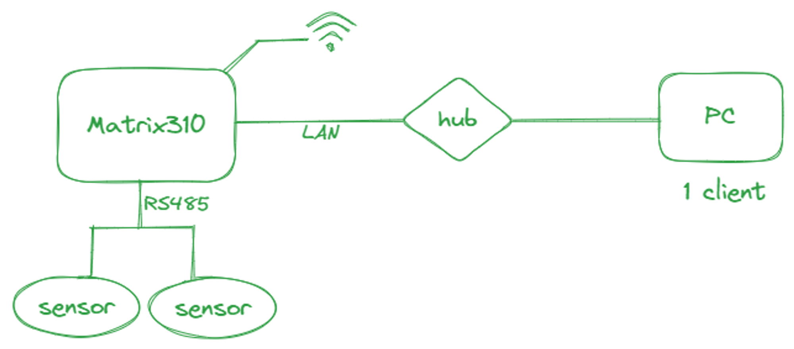
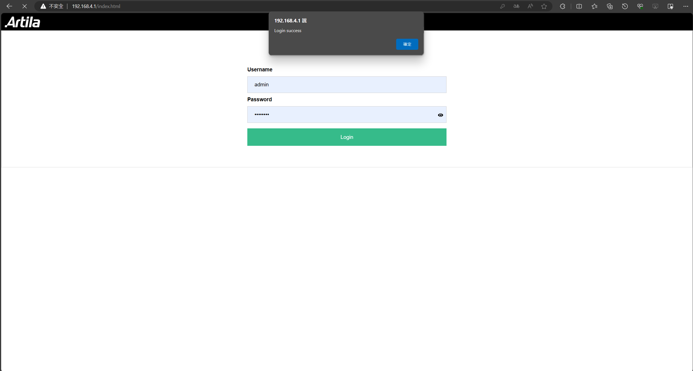
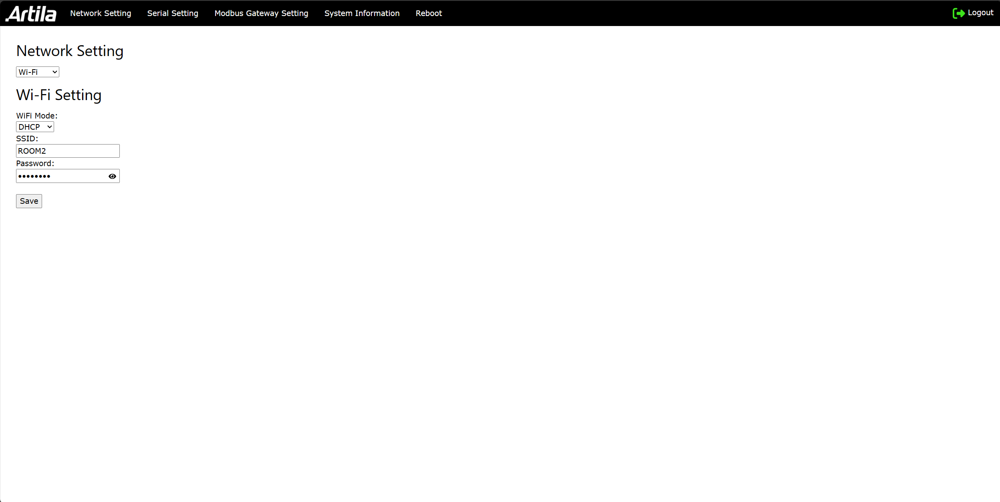
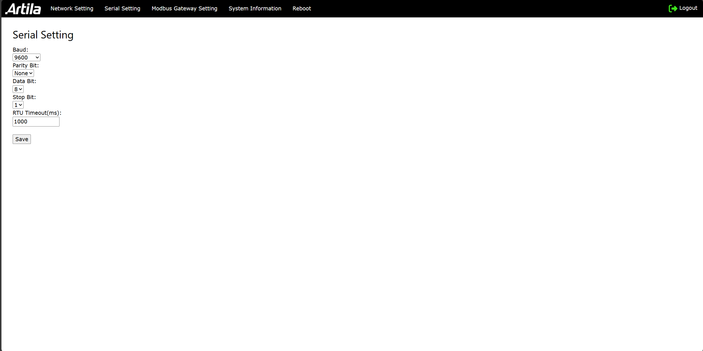
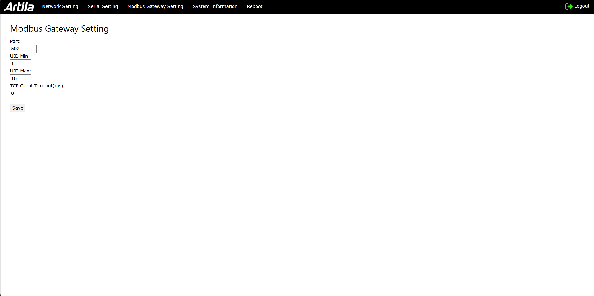
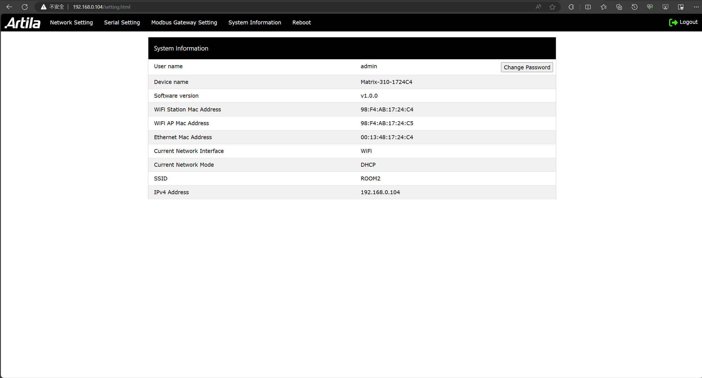
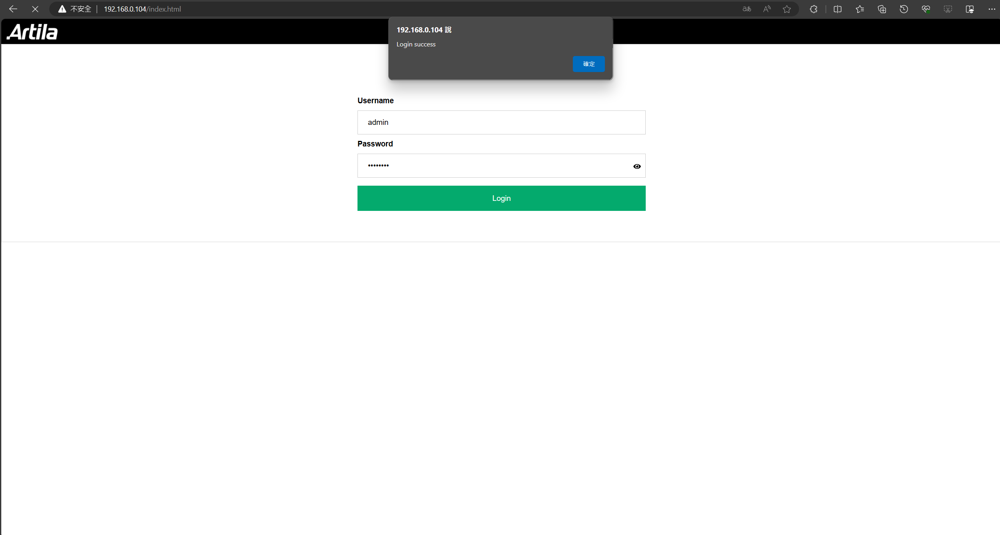
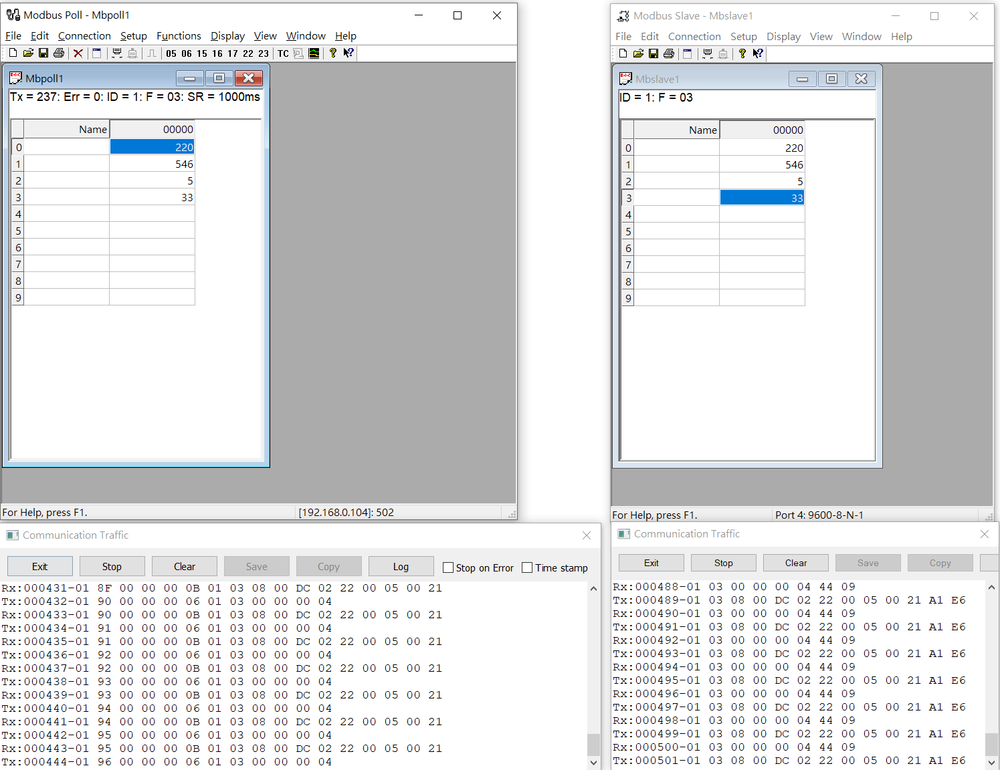

# Matrix-310 Modbus TCP Gateway

## Description

This project is a Modbus RTU to TCP gateway. It allows communication between Modbus RTU devices and Modbus TCP clients.

## Architecture diagram

## Table of Contents

- [Features](#Features)
- [Installation](#installation)
- [Setting](#Setting)
- [Usage](#usage)

## Features

- SOC: ESP32-D0WD-V3, Xtensa dual-core 32-bit LX6 microprocessor
- Hardware: V2
- Software: v1.0.0
- 10/100Mbps Ethernet x 1
- Wireless: IEEE 802.11 b/g/n, 2.4GHz Single Band
- COM1: Isolated RS-485 (1500Vrms isolation)
- Ready LED
- Rotary switch

## Installation

To install the Matrix-310 Modbus TCP Gateway, follow these steps:

1. Download the Flash Download Tools from [Espressif](https://www.espressif.com/en/support/download/other-tools).

2. Refer to the [partition table](compile/partitions.csv) file for the correct configuration.

3. Burn the [binary file](build) to Matrix-310.

## Setting

To configure the Matrix-310 Modbus TCP Gateway, follow these steps:

1. The first time you power on the Matrix-310, the device will enter the AP mode.
    - Connect to the device's Wi-Fi AP, and the default SSID is `Matrix-310-XXXXXX`, the default password is `00000000`.  

        
    - Visit the settings page with the IP address `192.168.4.1` to configure the device, you may log in with the default username `admin` and password `00000000`.

        

2. Navigate to the "Network Settings" section and configure the network parameters accordingly. For instance, set the device to operate in Wi-Fi station mode with DHCP enabled, and then input the SSID and password of your Wi-Fi network.  

    

3. Configure the serial settings to define the communication parameters of the Modbus RTU devices.  

    

4. Configure the gateway settings to define the port number, and other parameters for the Modbus TCP gateway.  

    

5. Don't forget to save the settings after each configuration change. You should reboot the device to apply the new settings.

5. Access the system information to view details about the Matrix-310 device. It will display the dhcp IP address after the new settings are applied.  

    

6. Next time you power on the Matrix-310, it will connect to the Wi-Fi network automatically. You can access the device with the IP address displayed on the system information page.  

    

7. If you want to reset the device to the factory settings, ratate the rotary switch to the `7` position, and then power on the device. The device will enter the AP mode, and you can reconfigure the device.

## Usage

To use the Matrix-310 Modbus TCP Gateway, follow these steps:

1. Connect your Modbus RTU devices to the Matrix-310 device.

2. Start the Matrix-310 device, the ready LED will turn on when the device is ready.

3. Open a Modbus TCP client application on your computer.

4. Enter the IP address and port number of the Matrix-310 device in the client application.

5. Use the client application to send Modbus TCP requests to the Matrix-310 device.

6. Monitor the responses from the Modbus RTU devices in the client application.  

